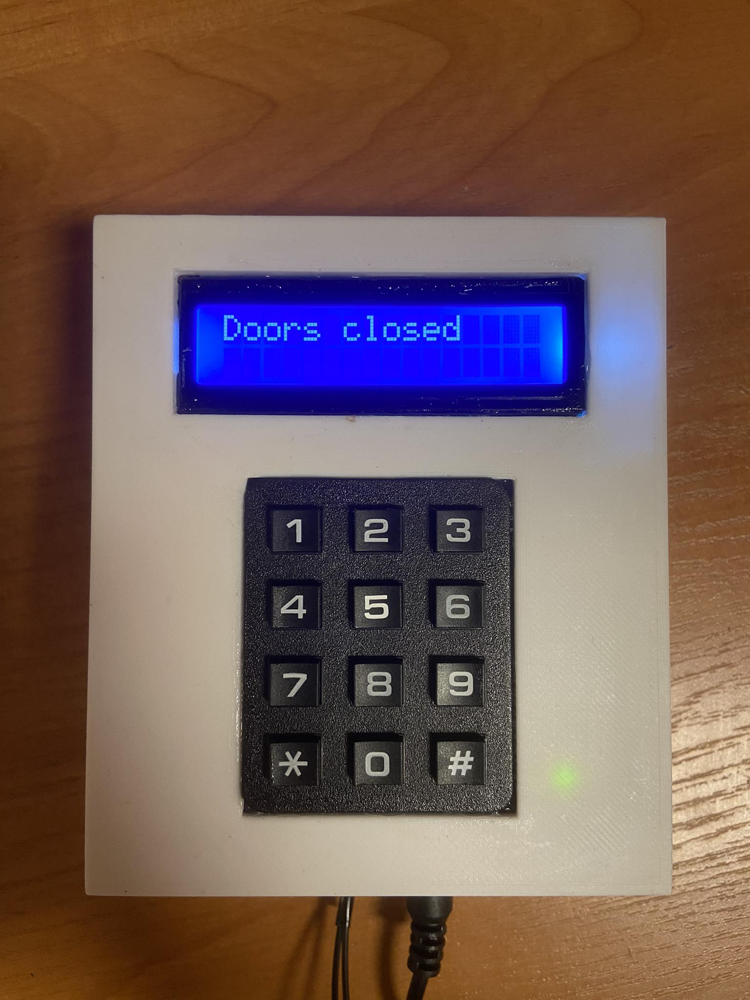
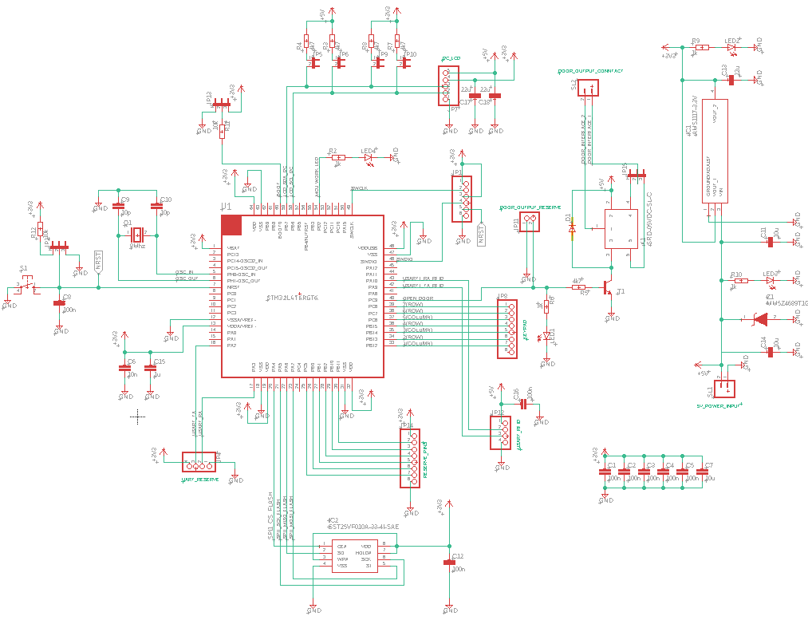

# RFID access point

STM32 based device controlling access. User can get access either by inputing 4 digit PIN code or placing RFID card to the device. 4 digit PIN code is deliberately intendent to be used only be the admin of the system, since entering the PIN code changes the state of the device to admin mode in which user database can be edited and the password changed. 

### Admin mode

As mentioned before entering correct PIN code changes the state of the device into admin mode in which databese can be directly edited. Admin mode allowes user to perform certain actions not availible in normal state, such as:

1. Adding new user to database by placing RFID card to the device.
2. Removing user already existing in database by placing his RFID car to the device.
3. Changing PIN code password.
4. Clearing all memory - removing all existing user from database.

